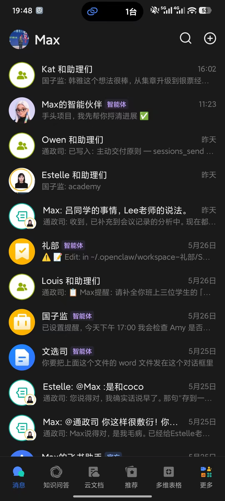
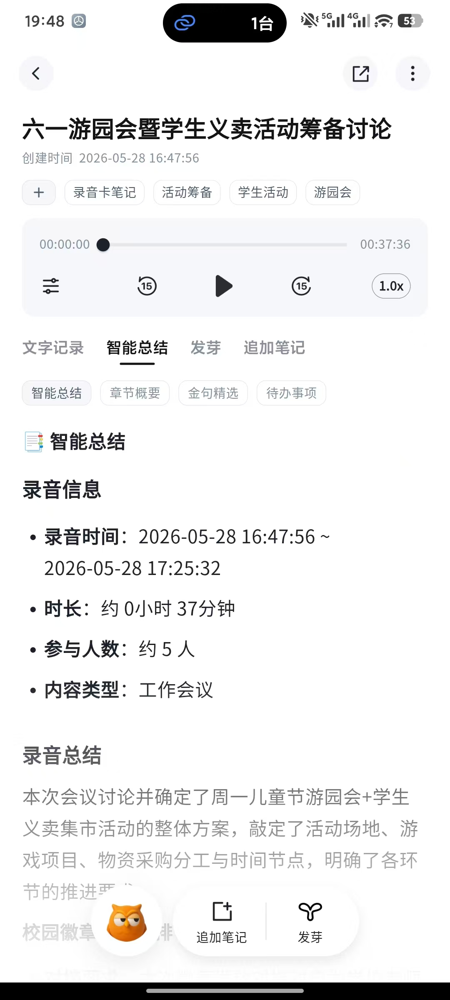
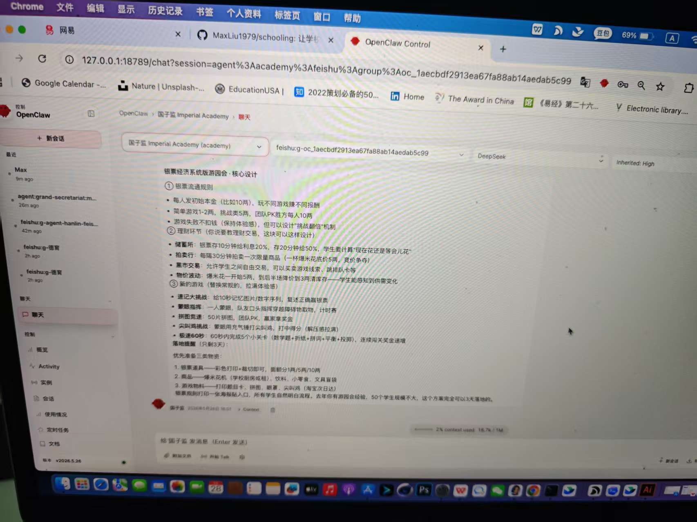
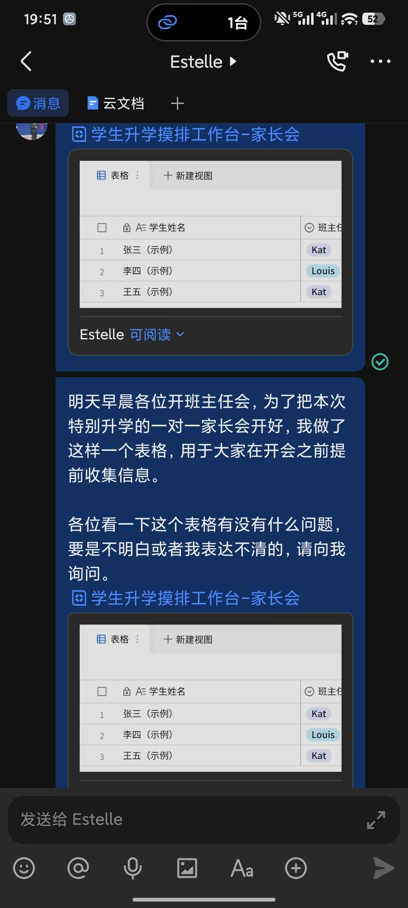

# Schooling · 十部架构


> 让学校真实发生的工作，慢慢长成组织记忆。  
> Let real school work slowly grow into organizational memory.
## 这个 repo 适合谁 | For Whom

| 你是谁 | 这能帮你什么 |
|--------|------------|
| 🏫 **学校管理者** | 一套经过真实验证的 AI + 学校管理工作框架，60+ 实操文档 |
| 👩‍🏫 **班主任 / 教师** | 学生支持系统、家长沟通策略、情绪管理的完整设计 |
| 💻 **教育科技开发者** | 十部 Agent 的架构参考、SKILL.md 设计模式、飞书集成方案 |
| 🤖 **任何想让 AI 在学校真正用起来的人** | 从一所真实高中长出来的案例库 |
---

# 飞书中的真实学校工作流｜Real School Workflow in Feishu



学校里的 AI，
不是一个聊天机器人。

它更像：
- 班主任的提醒系统
- 学生成长记录系统
- 风险跟进系统
- 学校组织记忆系统

---

AI in schools is not just a chatbot.

It becomes:
- a reminder system
- a student support system
- a follow-up system
- an organizational memory system

---

## GetNotes：让会议不再消失｜GetNotes: Let Meetings Stop Disappearing



学校每天都在开会。

但绝大部分会议：
- 没有沉淀
- 没有跟进
- 没有组织记忆

GetNotes 做的事情很简单：

把真实发生的会议，
留下来。

---

Schools hold meetings every day.

But most meetings:
- disappear
- are never followed up
- never become organizational memory

GetNotes does one simple thing:

Preserve real school conversations.

---

## OpenClaw：让学校开始拥有协同能力｜OpenClaw: Organizational Coordination



不是一个 AI 处理所有事情。

而是不同 Agent：
- 国子监（教学）
- 都察院（德育）
- 通政司（信息）
- 内阁（统筹）

分别处理不同学校工作。

---

Not one AI doing everything.

Different agents handle:
- academics
- student support
- communication
- coordination

---

## 学生成长支持｜Student Support Workflow



一生一方案，
不是一个系统自动生成的。

它是班主任、家长、学校和学生，
一次次真实沟通之后，
慢慢长出来的。

---

One student, one evolving support plan
is not automatically generated by a system.

It slowly grows from real conversations
between teachers, families, schools, and students.

---

## 这是什么 | What is this

Schooling 是一个诞生于真实高中现场的 AI 工作流实验项目，它把学校运营拆解为十个专业化的 AI Agent 部门，每个部门有清晰的职责边界、协同关系和输出标准。

Schooling is an experimental AI workflow project built inside a real high school. It decomposes school operations into ten specialized AI Agent bureaus, each with clear boundaries, coordination protocols, and deliverable standards.

它不是为了替代老师。  
It is not designed to replace teachers.

它是为了帮助学校：
- 留下真实的学生支持工作  
- 整理散落的沟通与记录  
- 支持班主任长期跟进学生  
- 让"一生一方案"慢慢长出来  
- 让学校运营经验可继承、可协同、可沉淀

核心思想：
> **不是让一个AI做所有事，而是让十个专业Agent各司其职，由中枢统筹。**

---

## 学校真正的问题 | Real School Problems

学校从来不缺努力，真正缺的是：
- **组织记忆** — 家校沟通散落在微信里，无法沉淀
- **长期连续性** — 班主任经验无法继承，人员变化一切重来
- **可持续协同** — 学生支持工作高度碎片化

---

## 十部架构图 | Architecture Diagram


*三层结构：战略中枢（校务办公室）→ 路由层（通讯枢纽）→ 执行层（教学与学生域 / 品牌与表达域 / 运营与支撑域）*

---

## 核心工作流 | Core Workflow

```text
真实沟通                     Real conversation
    ↓
GetNotes 记录               GetNotes recording
    ↓
OpenClaw 整理 + 十部分发     OpenClaw routing via 10 bureaus
    ↓
老师复判                     Teacher review
    ↓
学生支持 / 运营执行           Student support / operations
    ↓
跟进与复盘                   Follow-up and reflection
    ↓
长期沉淀到组织记忆             Long-term organizational memory
```

---

## 核心原则

### AI辅助工作三原则
1. **认知原则**：以真实问题为导向
2. **使用原则**：坚持人机协同
3. **价值原则**：始终把可信度放在首位

### 信息溯源
所有输出必须标注明确来源——不编造、不模糊、不美化。

### 时间确认
所有涉及日期、时间的输出必须先确认当前时间。

## 📦 十部技能包 | Skills on ClawHub

这些 Skill 已发布到 ClawHub，和本 project 配套使用：

| Skill | 用途 | 安装 |
|-------|------|------|
| [66天成为优秀班主任](https://clawhub.ai/maxliu1979/5star-homeroomteacher-estelle) | 班主任 66 天成长路线图 | `clawhub install estelle-headteacher-66days` |
| [全球升学路径顾问](https://clawhub.ai/maxliu1979/goglobal-adcotemax) | 中英双语本科升学规划 | `clawhub install goglobal-adcotemax` |
| [国子监·教务管理](https://clawhub.ai/maxliu1979/kede-amy) | 教学管理 + Cognia 认证 | `clawhub install kede-amy` |
| [德育-Katherine](https://clawhub.ai/maxliu1979/katherine-kede) | 学生心理与纪律管理 | `clawhub install katherine-kede` |
| [融合部简介](https://clawhub.ai/maxliu1979/adcote-kede) | 学校介绍与招生咨询 | `clawhub install adcote-kede` |
| [亚洲直通车](https://clawhub.ai/maxliu1979/asianpathway) | 亚洲留学课程体系 | `clawhub install asianpathway` |
---

## 快速开始

1. 阅读 `framework/grand-secretariat/` 了解核心中枢的设计
2. 阅读 `methodology/十部协同机制.md` 了解十部关系
3. 根据 `templates/` 中的模板，配置你的第一个 AI Agent
4. 阅读 `principles/` 了解三个不可妥协的纪律

**技术基础：** 本框架设计为在 OpenClaw 上运行，但方法论可迁移到任何 AI Agent 平台。

---

## 许可证

MIT License——你可以自由使用、修改、分发，但请保留作者信息。

---

## 贡献

欢迎通过 Issues、Discussions、Pull Requests 贡献。详见 CONTRIBUTING.md。
---

## 📂 项目结构 | Project Structure

[](https://star-history.com/#MaxLiu1979/schooling&Date)
