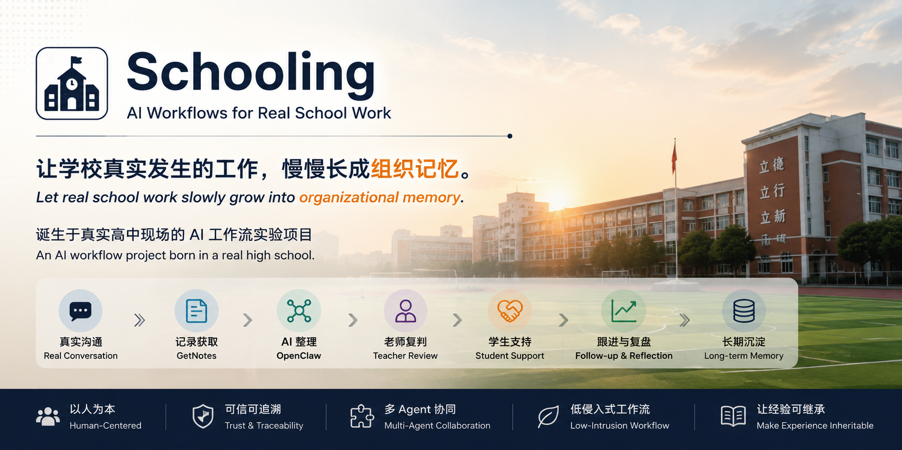
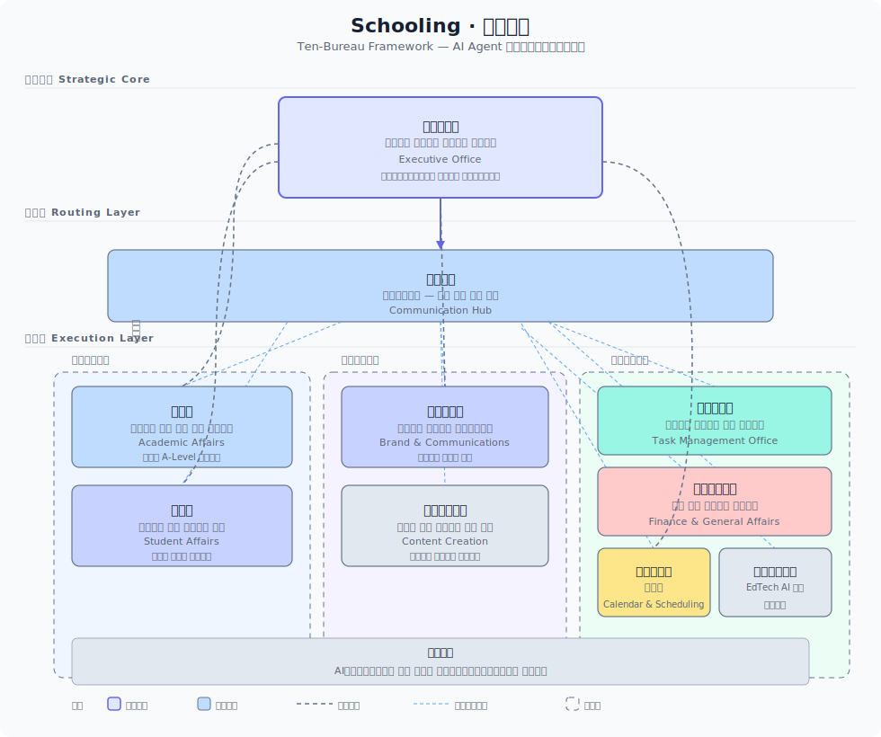

# Schooling · 十部架构




> 让学校真实发生的工作，慢慢长成组织记忆。  
> Let real school work slowly grow into organizational memory.

---

## 这是什么 | What is this

Schooling 是一个诞生于真实高中现场的 AI 工作流实验项目，它把学校运营拆解为十个专业化的 AI Agent 部门，每个部门有清晰的职责边界、协同关系和输出标准。

Schooling is an experimental AI workflow project built inside a real high school. It decomposes school operations into ten specialized AI Agent bureaus, each with clear boundaries, coordination protocols, and deliverable standards.

它不是为了替代老师。  
It is not designed to replace teachers.

它是为了帮助学校：
- 留下真实的学生支持工作  
- 整理散落的沟通与记录  
- 支持班主任长期跟进学生  
- 让"一生一方案"慢慢长出来  
- 让学校运营经验可继承、可协同、可沉淀

核心思想：
> **不是让一个AI做所有事，而是让十个专业Agent各司其职，由中枢统筹。**

---

## 学校真正的问题 | Real School Problems

学校从来不缺努力，真正缺的是：
- **组织记忆** — 家校沟通散落在微信里，无法沉淀
- **长期连续性** — 班主任经验无法继承，人员变化一切重来
- **可持续协同** — 学生支持工作高度碎片化

---

## 十部架构图 | Architecture Diagram



*三层结构：战略中枢（校务办公室）→ 路由层（通讯枢纽）→ 执行层（教学与学生域 / 品牌与表达域 / 运营与支撑域）*

---

## 十部架构 | Ten-Bureau Architecture

```
schooling/
├── framework/                # 十部框架核心
│   ├── grand-secretariat/    # 校务办公室（战略中枢）
│   ├── transmission-bureau/  # 通讯枢纽（路由层）
│   ├── imperial-college/     # 教务处（教学与学生域）
│   ├── censorate/            # 学生处（教学与学生域）
│   ├── ministry-of-rites/    # 品牌宣传部（品牌与表达域）
│   ├── imperial-academy/     # 内容创作中心（品牌与表达域）
│   ├── selection-office/     # 任务管理处（运营与支撑域）
│   ├── ministry-of-revenue/  # 财务与总务处（运营与支撑域）
│   ├── astronomical-bureau/  # 校历与日程管理处（运营与支撑域）
│   └── inspection-department/# 教育技术中心（运营与支撑域）
├── principles/               # 三大核心原则
├── templates/                # 可复用模板
├── skills/                   # 教师经验 Skill 化
│   ├── adcote-kede/          # 科德高中融合部介绍
│   ├── asian-class/          # 亚洲直通车课程体系
│   ├── headteacher-66days/   # 66天成为优秀班主任
│   └── goglobal-adcotemax/   # 全球升学路径顾问
├── methodology/              # 方法论文档
└── docs/                     # 部署与使用指南
```

---

## 核心工作流 | Core Workflow

```text
真实沟通                     Real conversation
    ↓
GetNotes 记录               GetNotes recording
    ↓
OpenClaw 整理 + 十部分发     OpenClaw routing via 10 bureaus
    ↓
老师复判                     Teacher review
    ↓
学生支持 / 运营执行           Student support / operations
    ↓
跟进与复盘                   Follow-up and reflection
    ↓
长期沉淀到组织记忆             Long-term organizational memory
```

---

## 核心原则

### AI辅助工作三原则
1. **认知原则**：以真实问题为导向
2. **使用原则**：坚持人机协同
3. **价值原则**：始终把可信度放在首位

### 信息溯源
所有输出必须标注明确来源——不编造、不模糊、不美化。

### 时间确认
所有涉及日期、时间的输出必须先确认当前时间。

---

## 快速开始

1. 阅读 `framework/grand-secretariat/` 了解核心中枢的设计
2. 阅读 `methodology/十部协同机制.md` 了解十部关系
3. 根据 `templates/` 中的模板，配置你的第一个 AI Agent
4. 阅读 `principles/` 了解三个不可妥协的纪律

**技术基础：** 本框架设计为在 OpenClaw 上运行，但方法论可迁移到任何 AI Agent 平台。

---

## 许可证

MIT License——你可以自由使用、修改、分发，但请保留作者信息。

---

## 贡献

欢迎通过 Issues、Discussions、Pull Requests 贡献。详见 CONTRIBUTING.md。
